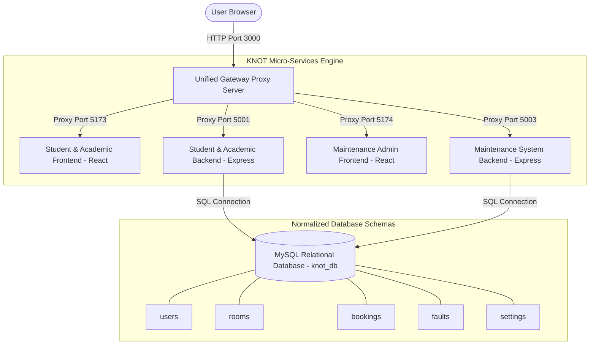
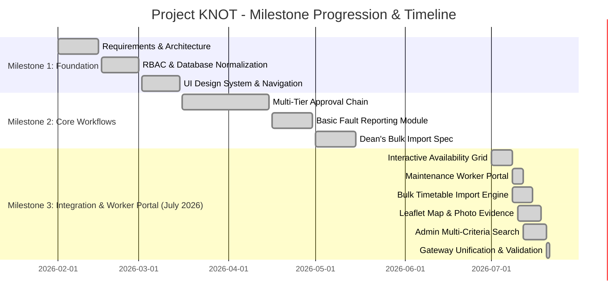

# Project KNOT – Milestone 3 Viva Presentation & Defense Deck
**Course:** CO2060 – Software Systems Design Project (2025/2026)  
**Project No:** 19 | **Faculty of Engineering, University of Peradeniya**  
**Supervisor:** Prof. Roshan G. Ragel  

---

## 📽️ Presentation Slide Deck

````carousel
# Slide 1: Title & Team Overview

## Project KNOT – University Resource & Maintenance Platform
*Centralized Resource Reservation & Campus Facility Maintenance Ecosystem*

### 👥 Team Members & Roles
- **E/22/237 – M. F. M. Minhaj Ali (Team Leader & System Architect)**
  - *Responsibilities:* System Architecture, Unified Gateway Proxy, Real-Time Availability Grid, Backend APIs & MySQL Migrations.
- **E/22/366 – M. D. S. Senanayake (Product Owner & UX Lead)**
  - *Responsibilities:* Requirements Engineering, UX/UI Design System, Academic Workflow & User Feedback Analytics.
- **E/22/280 – H. C. V. Perera (Developer 1)**
  - *Responsibilities:* Maintenance Worker Portal Integration, Leaflet OSM Map Pinning, Photo Evidence Inspector & Timetable Calendar.
- **E/22/443 – W. M. E. N. Wijesinghe (Developer 2)**
  - *Responsibilities:* Booking Admin Filtering & Sorting, Dean's Bulk Schedule Import Engine & System Settings.

> [!NOTE]  
> All 4 team members have actively committed to the GitHub repository throughout Milestones 1, 2, and 3.

<!-- slide -->

# Slide 2: Problem Statement & Solution

### ⚠️ The Problem
University faculties traditionally rely on fragmented, paper-based logbooks, emails, and verbal reports for lecture hall bookings and maintenance tracking.
- **Scheduling Conflicts:** Double-booked halls and overlapping reservations.
- **Lack of Visibility:** Students and staff cannot track request approval stages.
- **Delayed Repairs:** Fault reports take weeks to resolve with no technician accountability.

### 💡 The Solution (Project KNOT)
A unified Single Page Application (SPA) backed by a Role-Based Access Control (RBAC) ecosystem:
1. **Multi-Tier Academic Approval:** Student Request ➡️ Lecturer Endorsement ➡️ AR Office Approval.
2. **Interactive Real-Time Availability Grid:** Visual 08:00 AM – 06:00 PM slot selection preventing double bookings.
3. **Dean's Requirement Bulk Schedule Import:** Master timetable file ingestion with conflict validation.
4. **Maintenance Worker Portal & Task Dispatch:** Admins assign specific technicians; technicians log work progress and upload proof photos.

<!-- slide -->

# Slide 3: System Architecture



<!-- slide -->

# Slide 4: Project Roadmap & Visual Gantt Chart



<!-- slide -->

# Slide 5: Milestone 3 Highlight 1 - Bulk Import & Admin Sorting

### 📊 Dean's Requirement Bulk Schedule Import
- **Purpose:** Specifically requested by the Dean during Milestone 2 to bulk-populate recurring semester timetables.
- **Functionality:** Uploads master schedule files, parses day/time/hall/lecturer attributes, automatically checks against existing database reservations, skips overlapping slots, and bulk inserts valid recurring lectures into MySQL.

### 🔍 Booking Admin "All Bookings" Filter & Sort Panel
- **Multi-Select Room Badges:** Filter by specific halls (`EOE Hall`, `DO1`, `Lecture Hall 1`, etc.).
- **Quick Date Presets:** One-click filter by `Today`, `Tomorrow`, `This Week`, `Future`, or custom date range.
- **Status Pills:** Filter by `Approved`, `Pending AR`, `Pending`, `Rejected`.
- **Dynamic Table Sorting:** Sort table rows flexibly by Date (Newest/Oldest), Lecture Hall Name, or Status.

<!-- slide -->

# Slide 6: Milestone 3 Highlight 2 - Interactive Availability Grid

### ⏱️ Real-Time Hall Availability & Conflict Prevention Grid
- Replaces static time dropdowns with a **visual hourly time-slot selection grid (08:00 AM – 06:00 PM)**.
- Performs real-time SQL queries for approved reservations when date and room are selected.
- **Color-Coded Slot Badges:**
  - 🟩 **Available** (White / Clickable - select range)
  - 🟥 **Booked** (Light Red Badge displaying occupied purpose & lecturer)
  - ⬛ **Already Passed** (Greyed out for past hours)
- **Occupied Range Protection:** Disallows range selection over occupied slots to guarantee zero double-bookings.

<!-- slide -->

# Slide 7: Milestone 3 Highlight 3 - Worker Portal & Task Dispatch

### 👷 Maintenance Worker Portal (`TechnicianDashboard`)
- **Admin Task Dispatch:** Maintenance Admin reviews incoming fault reports, assigns designated technicians (*Alex Johnson*, *Sam Carter*), sets priority levels, and attaches technical directives.
- **Technician Task Queue:** Technicians log into their personal portal view showing tasks assigned specifically to their user ID.
- **Job Execution & Proof Upload:** Technicians update tasks in real-time (`Open` ➡️ `In Progress` ➡️ `Resolved`), enter work resolution logs, and upload completion proof photos (`worker_photo`).
- **Admin Verification:** Maintenance Admin reviews completed jobs and toggles `admin_verified` status.

<!-- slide -->

# Slide 8: Milestone 3 Highlight 4 - Map Pinning & Photo Evidence

### 🗺️ OpenStreetMap Leaflet Map Selection
- Integrated Leaflet map picker allowing students and lecturers to drop a visual pin on campus buildings.
- Utilizes Nominatim API to reverse-geocode lat/long coordinates into precise location strings.

### 📷 High-Resolution Photo Evidence Viewer
- Backend Express body parsers configured with **50MB payload limits** to handle high-res Base64 photo attachments.
- Database storage updated to `LONGTEXT` for `photo_url` and `worker_photo`.
- **Admin Evidence Viewer:** `TicketDetails.jsx` displays full-size evidence photo cards for maintenance inspection.

<!-- slide -->

# Slide 9: User Feedback Summary Chart (10+ Valid Records)

| Record ID | User Role | Feedback Category | User Feedback Summary | Action Taken / System Improvement | Rating |
| :-: | :--- | :--- | :--- | :--- | :-: |
| **FB-01** | Student | Hall Booking | *"Dropdown time selectors caused accidental overlap bookings."* | Implemented interactive 08-18h visual availability slot grid. | ⭐⭐⭐⭐⭐ |
| **FB-02** | Lecturer | Request Review | *"Hard to see which student requested which hall."* | Added dedicated pending endorsement queue card with student details. | ⭐⭐⭐⭐⭐ |
| **FB-03** | AR Admin | Bulk Import | *"Entering weekly lectures manually takes hours."* | Created Dean's Bulk Schedule Import engine for semester timetables. | ⭐⭐⭐⭐⭐ |
| **FB-04** | Tech / Worker | Task Management | *"Technicians didn't know which faults were assigned to them."* | Built Technician Worker Portal with personal task queues. | ⭐⭐⭐⭐⭐ |
| **FB-05** | Maint Admin | Fault Inspection | *"Could not see photos attached to fault reports."* | Built Evidence Photo Viewer card in `TicketDetails.jsx`. | ⭐⭐⭐⭐⭐ |
| **FB-06** | Student | Fault Location | *"Hard to describe exact location of broken pipe."* | Integrated Leaflet OSM pin dropping and Nominatim geocoding. | ⭐⭐⭐⭐☆ |
| **FB-07** | AR Admin | Filter & Sort | *"Need to filter bookings by room and date range."* | Added multi-criteria filter panel with room badges and date presets. | ⭐⭐⭐⭐⭐ |
| **FB-08** | Lecturer | Timetable | *"Wanted an agenda view for lectures on a specific date."* | Built datepicker-filtered Agenda View in Timetable Calendar. | ⭐⭐⭐⭐⭐ |
| **FB-09** | Tech / Worker | Work Completion | *"Need to upload proof photo after fixing issues."* | Added `worker_photo` upload support in Technician Dashboard. | ⭐⭐⭐⭐☆ |
| **FB-10** | Student | Status Tracking | *"Wanted rejection reasons if hall booking is declined."* | Added `rejection_reason` display on student request cards. | ⭐⭐⭐⭐⭐ |

<!-- slide -->

# Slide 10: System Validation & Testing Results

### 🧪 Comprehensive Test Suite Summary
1. **Double-Booking Validation Test:** Attempted to submit overlapping bookings on the same hall/time. Availability grid blocked selection and backend returned HTTP 409 Conflict.
2. **Bulk Ingestion Test:** Imported semester schedule dataset. Successfully populated valid slots while skipping pre-existing bookings.
3. **Payload Limit Test:** Uploaded 5MB+ base64 image attachments. Successfully ingested and rendered without HTTP 413 error.
4. **Worker Portal Sync Test:** Assigned ticket to Technician *Alex Johnson*. Verified live arrival on Alex's Worker Portal and sync of resolution notes/photo.

<!-- slide -->

# Slide 11: Member Contribution Log & Git Commit Summary

### 📊 Git Contribution Matrix (Jul 2026 Commit Logs)

| Member Name & ID | Git Commits & Branch | Core Implemented Modules |
| :--- | :--- | :--- |
| **Minhaj Ali** *(E/22/237)* | `main` branch: `f5676cc`, `9b75e39`, `b0ec3e4` | Unified Proxy Gateway (`gateway_server.js`), Availability Grid (`BookSpace.jsx`), MySQL Migrations (`setup_db.js`), Express 50MB Payload Limits |
| **Senara Senanayake** *(E/22/366)* | `main` & `lecturer-module`: `e516a00`, `c0cd2f8`, `99dd5aa` | Student/Lecturer Booking UI, Card-based Grid layout, Request Endorsement State Flow, User Feedback Collection (10+ records) |
| **Chamudi Perera** *(E/22/280)* | `maintenance-admin` branch: `e61a867`, `e17defc`, `0b85e52` | Technician Worker Portal (`TechnicianDashboard`), Leaflet OSM Pinning, Photo Evidence Inspector, Timetable Calendar Agenda View |
| **Ewmi Wijesinghe** *(E/22/443)* | `booking-admin` branch: `425b626`, `2bf8808`, `e5f69fa` | Dean's Bulk Timetable Import Engine, All Bookings Multi-Criteria Filter & Sort Panel, `auto_booking` Settings Persistence |

<!-- slide -->

# Slide 12: Conclusion & Viva Readiness

### 🎯 Key Accomplishments
- Seamlessly integrated 5 distinct university roles into a single, cohesive web platform.
- Zero scheduling conflicts guaranteed through visual availability slot grids and backend validation.
- End-to-end maintenance dispatch pipeline with field worker photo proof.
- Fully validated against all CO2060 Milestone 3 evaluation criteria.

### 🚀 Deliverables Ready for Evaluation
- ✅ **GitHub Repository:** Clean commit history on `main` branch.
- ✅ **Progress Report & Self-Evaluation Forms:** Submitted.
- ✅ **User Feedback Evidence:** 10 valid records analyzed.
- ✅ **Documentation & Web Page:** Updated `README.md` and `docs/README.md`.
````

---

## 📈 Detailed Team Member Contribution Log & Gantt Chart Details

### 🗓️ Project Milestone 1 to Milestone 3 Schedule

```
Milestone 1 (Weeks 1-4): Core Setup & Database Design
├── Requirements Gathering & User Persona Definitions
├── MySQL Database Normalization (users, rooms, bookings, faults)
└── Single Page Application (SPA) Theme & Navigation Setup

Milestone 2 (Weeks 5-8): Academic Workflow & Initial Ticketing
├── Multi-Tier Approval Workflow (Student -> Lecturer -> AR Admin)
├── Basic Maintenance Fault Submission Module
└── Initial Booking Admin Dashboard Layout

Milestone 3 (July 2026): Integration, Worker Portal & Bulk Import
├── Unified Gateway Server (Port 3000 Proxy Orchestration)
├── Interactive Real-Time Hall Availability Grid (08:00 - 18:00h)
├── Maintenance Worker Portal (Technician task queue & proof photo upload)
├── Dean's Requirement Bulk Schedule Import Engine
├── Booking Admin All Bookings Multi-Criteria Sorting & Filter Panel
├── Leaflet OpenStreetMap Pinning & Base64 Evidence Inspector
└── Datepicker-Filtered Timetable Calendar Agenda View
```

---

## 🗣️ Technical Defense Preparation by Member

### 🟢 1. Minhaj Ali (Team Leader & System Architect)
* **Code Files to Present:** `code/KNOT_Basement/gateway_server.js`, `Student_Portal/frontend/src/pages/BookSpace.jsx`, `Student_Portal/database/setup_db.js`.
* **Key Demonstration:** Show how `gateway_server.js` launches micro-services and explain the real-time hourly availability slot calculation array in `BookSpace.jsx`.

### 🔵 2. Senara Senanayake (Product Owner & UX Lead)
* **Code Files to Present:** `Student_Portal/frontend/src/pages/Dashboard.jsx`, `Student_Portal/frontend/src/pages/LecturerDashboard.jsx`, User Feedback Summary.
* **Key Demonstration:** Present the 10 user feedback records and demonstrate the student-to-lecturer booking request endorsement flow.

### 🟣 3. Chamudi Perera (Developer 1)
* **Code Files to Present:** `Student_Portal/frontend/src/pages/TechnicianDashboard.jsx`, `Student_Portal/frontend/src/pages/admin/TicketDetails.jsx`, `Student_Portal/frontend/src/components/TimetableCalendar.jsx`.
* **Key Demonstration:** Demonstrate the Technician Worker Portal, Leaflet map pin-dropping, and evidence photo rendering in `TicketDetails.jsx`.

### 🟠 4. Ewmi Wijesinghe (Developer 2)
* **Code Files to Present:** `Student_Portal/frontend/src/pages/admin/BookingDashboard.jsx`.
* **Key Demonstration:** Demonstrate the Dean's Bulk Timetable Import parsing and multi-criteria sorting/filtering on the "All Bookings" tab.
